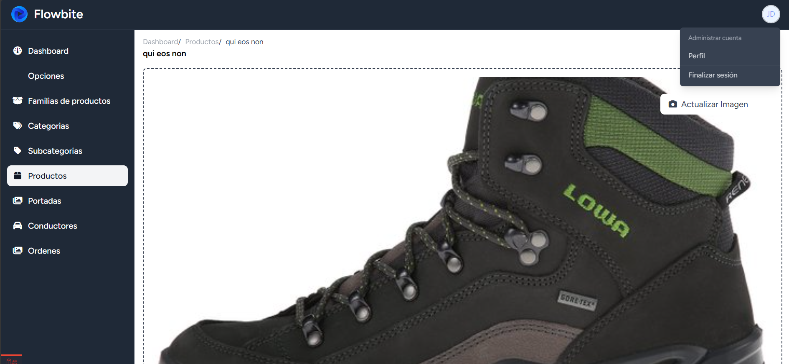

```
Family
 └── Category
       └── Subcategory
```   
### Pace	Chapters per Day	Remaining Chapters	  

27->37->48->57->78->82->91->102->109->125->12? = 133
    10  11  9   21  4   9   11    7    16   
YOU'VE TO MAKE 15 PER DAY

Option → products

Product → subcategory

Subcategory → category

Category → family
 


Intense	5	41	~8 days	Just over 1 week
Steady	3	41	~14 days	About 2 weeks
Relaxed	1	41	41 days	About 6 weeks (1.5 months)

Keep in mind:

Chapter Length/Complexity: If the remaining chapters are longer or cover more complex topics (like the product CRUD and shopping cart), you might need to allocate more time for those.

Practice: The best way to learn to program is to practice. Make sure you're not just watching the videos but actively writing the code and doing the exercises. This might slow down your completion time but will greatly increase your learning.

You're already doing great by reaching chapter 27! Keep up the momentum.

## 🚀 Módulos del Proyecto

### ✅ Completados

- [x] Introducción  
- [x] Diseño de la BBDD  
- [x] Administrador  
- [x] CRUD Familias  
- [x] SweetAlert 2  
- [x] CRUD de Categorías  
- [x] CRUD de Subcategorías  
- [x] CRUD de Productos  

<details>
  <summary>🧱 Variantes (6 pasos)</summary>

  - [x] Crear variantes 1  
  - [x] Crear variantes 2  
  - [x] Recursividad  
  - [X] Generar variantes  
  - [X] Mostrar variantes  
  - [X] Editar variantes  

</details>

- [x] Cabecera  

--- 

- [X] Portadas  
<details>
  <summary>Filtros (11 pasos)</summary>

  - [x] Mostrar opciones y features por familia  
  - [x] Mostrar opciones y features por familia II  
  - [x] Mostrar y ocultar features  
  - [x] Mostrar productos por familia  
  - [x] Volver responsivo pagina filtros  
  - [x] Filtrar productos por features 
  - [x] Cambiar el orden en el que se muestran los productos 
  - [x] Utilizr el buscador para filtrar 
  - [x] Filtrar por categoria
  - [x] Filtrar por subcategoria
  - [x] Query scope

</details>
<details>
  <summary> Carrito de Compras (9 pasos)</summary>

  - [x] Mostrare el detalle del producto  
  - [x] Instalar Laravel Shoppingcart 
  - [x] Elegir cantidad de Items que se comprara  
  - [x] Agregar items al carrito  
  - [x] Guardar carrito de compras en la bd  
  - [x] Mostrar cantidad de items agregados al carrito 
  - [x] Mostrar items agregados al carrito de compra
  - [x] Mostrar items del carrito de compra 
  - [x] Actualizar carrito de compras

</details>
<details>
  <summary> Direcciones (10 pasos)</summary>

  - [x] Agregar nuevos campos en la tabla users  
  - [x] Crear tabla addresses  
  - [x] Formulario para agregar nueva direccion  
  - [x] Especificar quien recibira el pedido  
  - [x] Crear nueva direccion  
  - [x] Mostrar listado de direcciones agregadas  
  - [x] Mostrar direccion por defecto
  - [x] Editar direccion 
  - [X] Eliminar direcciones  
  - [X] Mostrar el Resumen del carrito  

</details>
<details>
  <summary> Pasarela de Pago (9 pasos)</summary>

  - [x] Diseñar Checkout  
  - [x] Credenciales de Niubiz 
  - [x] Generar token de sesion  
  - [x] Inlcuir boton de pago  
  - [x] Capturar pago  
  - [x] Mostrar mensaje gracias
  - [x] Mostrar mensaje error

</details>
<details>
  <summary>Administrar Órdenes(15 pasos)</summary>

  - [x] Crear modelo order 
  - [x] Registrar orden
  - [x] Crear ticket de despacho
  - [x] Crear ticket desde un observer
  - [x] Crear ruta para administrar ordenes
  - [x] Instalar laravel-livewire-tables
  - [x] Mostrar Ordenes
  - [x] Descargar ticket
  - [x] Cambiar status a listo para despachar
  - [x] Crear crud conductores    
  - [x] Listar conductores  
  - [x] Eliminar conductor  
  - [x] Generar envio de una orden
  - [x] Mostrar envios  
  - [x] Filtrar envios   

</details>
<details>
  <summary>Solucionar Errores (5 pasos)</summary>

  - [x] Agregar middleware auth al checkout
  - [ ] Editar variantes *3  
  - [ ] Refactorizar componente add-to cart

</details>
<details>
  <summary>Stock (5 pasos)</summary>

  - [x] Controlar stock que se agrega *2
  - [ ] Descontar stock

</details>
<details>
  <summary>Laravel Permission (7 pasos)</summary>

  - [x] Instalar spatie  
  - [x] Definir Permisos  
  - [x] Definir Roles  
  - [x] Proteger rutas segun lo permisos  
  - [ ] Mostrar listado de usuarios 
  - [ ] Agregar Buscador  
  - [ ] Asignar Rol 

</details>



composer require hardevine/shoppingcart
php artisan vendor:publish --provider="Gloudemans\Shoppingcart\ShoppingcartServiceProvider" --tag="migrations"
composer require rappasoft/laravel-livewire-tables
php artisan vendor:publish --provider="Rappasoft\LaravelLivewireTables\LaravelLivewireTablesServiceProvider" --tag=livewire-tables-config

php artisan event:generate

CoverController / migration = image_path
ProductController / migration = image_path
ProductCreate  = image_path
ProductEdit  = image_path
AddToCard  = image
AddToCardVariants  = image
Variants  = image_path